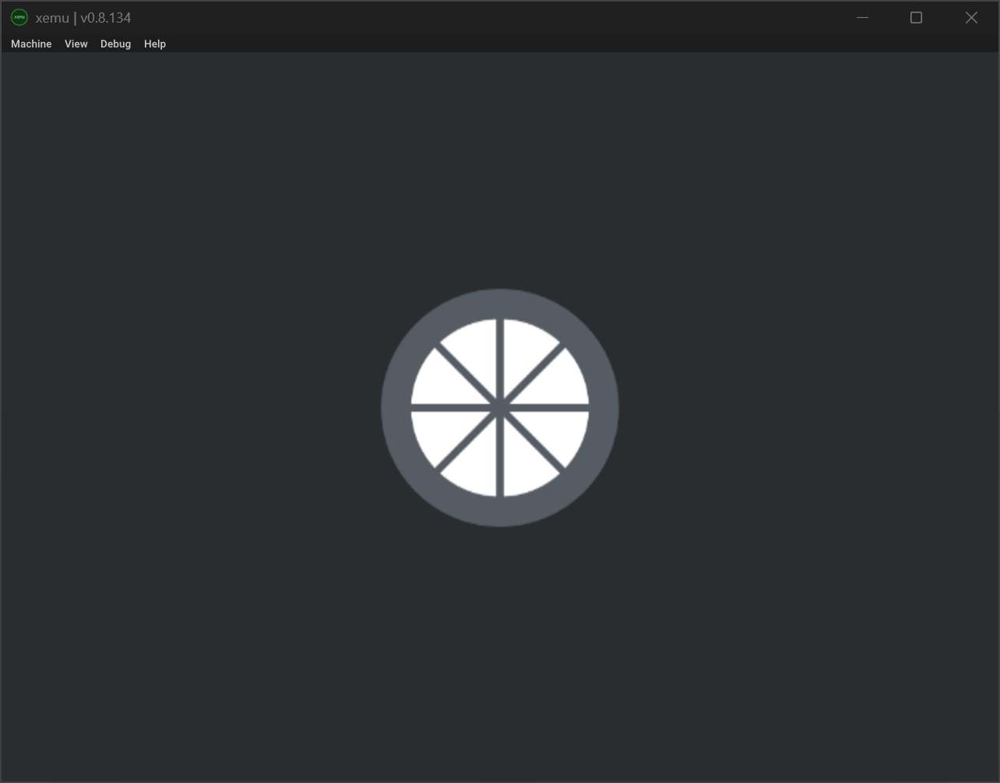

# Moonlight-XboxOG

[](https://github.com/LizardByte/Moonlight-XboxOG)
[](https://github.com/LizardByte/Moonlight-XboxOG/releases/latest)
[](https://github.com/LizardByte/Moonlight-XboxOG/actions/workflows/CI.yml?query=branch%3Amaster)
[](https://codecov.io/gh/LizardByte/Moonlight-XboxOG)

Port of Moonlight for the Original Xbox. Unlikely to ever actually work. Do NOT use!

Nothing works, except the splash screen.




## Build

### Prerequisites

1. Clone the repository with submodules, or update them after cloning.

   ```bash
   git submodule update --init --recursive
   ```

2. Install nxdk prerequisites.

#### Windows

> [!NOTE]
> You must use the mingw64 shell on Windows.

```bash
pacman -Syu
nxdk_dependencies=(
  "bison"
  "cmake"
  "flex"
  "git"
  "make"
  "mingw-w64-x86_64-clang"
  "mingw-w64-x86_64-gcc"
  "mingw-w64-x86_64-lld"
  "mingw-w64-x86_64-llvm"
)
moonlight_dependencies=(
  "mingw-w64-x86_64-doxygen"
  "mingw-w64-x86_64-graphviz"
  "mingw-w64-ucrt-x86_64-nodejs"
)
dependencies=("${nxdk_dependencies[@]}" "${moonlight_dependencies[@]}")
pacman -S "${dependencies[@]}"
```

#### Debian/Ubuntu Linux

```bash
nxdk_dependencies=(
  "bison"
  "build-essential"
  "clang"
  "cmake"
  "flex"
  "git"
  "lld"
  "llvm"
)
moonlight_dependencies=(
  "doxygen"
  "graphviz"
  "nodejs"
)
dependencies=("${nxdk_dependencies[@]}" "${moonlight_dependencies[@]}")
apt install "${dependencies[@]}"
```

#### macOS

```bash
nxdk_dependencies=(
  "cmake"
  "coreutils"
  "lld"
  "llvm"
)
moonlight_dependencies=(
  "doxygen"
  "graphviz"
  "node"
)
dependencies=("${nxdk_dependencies[@]}" "${moonlight_dependencies[@]}")
brew install "${dependencies[@]}"
```

### Configure

Configure the top-level project with the normal host toolchain. CMake uses the vendored `third-party/nxdk` checkout, bootstraps the required `nxdk` outputs, builds the host-native tests with the standard compiler/linker, and drives the Xbox build through an internal child configure that reuses the stock `nxdk` toolchain.

```bash
cmake -S . -B cmake-build-release -DBUILD_DOCS=OFF -DCMAKE_BUILD_TYPE=Release
```

### Build

```bash
cmake --build cmake-build-release
```

### Combined script

This script takes care of everything, except installing the prerequisites.

```bash
./build.sh
```

The default build directory is `cmake-build-release`. You can override it or force a clean build:

```bash
./build.sh --build-dir cmake-build-debug
./build.sh --clean
./build.sh cmake-build-custom clean
```

To launch the same build from shells outside MSYS2 on Windows, use one of these wrappers:

```bat
build-mingw64.bat
```

```bash
./build-mingw64.sh
```

### Host-native unit tests

The Xbox executable cannot run directly on Windows, macOS, or Linux, so the top-level project builds `test_moonlight` natively while the Xbox binary is built by an internal child configure that uses the `nxdk` toolchain. Keep Xbox runtime code thin and move logic you want to test into platform-neutral sources that can be linked into `test_moonlight`.

#### Windows via MSYS2/mingw64

From `cmd.exe`, configure, build, and run the host tests after the helper locates your local MSYS2 installation:

```bat
call scripts\find-msys2.cmd && "%MOONLIGHT_MSYS2_SHELL%" -defterm -here -no-start -mingw64 -c "cd /c/Users/%USERNAME%/Dev/git/Moonlight-XboxOG && cmake -S . -B cmake-build-host-tests -DBUILD_DOCS=OFF -DBUILD_TESTS=ON -DBUILD_XBOX=OFF -DCMAKE_BUILD_TYPE=Debug && cmake --build cmake-build-host-tests --target test_moonlight && ctest --test-dir cmake-build-host-tests --output-on-failure"
```

If you are already inside a `mingw64` shell, the equivalent commands are:

```bash
cmake -S . -B cmake-build-host-tests -DBUILD_DOCS=OFF -DBUILD_TESTS=ON -DBUILD_XBOX=OFF -DCMAKE_BUILD_TYPE=Debug
cmake --build cmake-build-host-tests --target test_moonlight
ctest --test-dir cmake-build-host-tests --output-on-failure
```

#### Linux or macOS

```bash
cmake -S . -B cmake-build-host-tests -DBUILD_TESTS=ON -DBUILD_XBOX=OFF -DBUILD_DOCS=OFF
cmake --build cmake-build-host-tests --target test_moonlight
ctest --test-dir cmake-build-host-tests --output-on-failure
```

Coverage should come from this host-native test build instead of the cross-compiled Xbox build.

### CLion on Windows

The Windows preset in `CMakePresets.json` uses `MinGW Makefiles` for the host-native CLion build, auto-detects the local MSYS2 installation through `cmake/host-mingw64-clang.cmake`, and delegates the Xbox child build through a dedicated CMake driver that enters the vendored `nxdk` environment only for the child configure and build steps.

1. Open the project in CLion and import the `nxdk-release (mingw64)` preset from `CMakePresets.json`.
2. Use the normal build button with that profile selected. The top-level build will compile `test_moonlight` natively and configure the Xbox child build automatically.
3. When you use CLion's **Reset Cache and Reload Project**, the next configure will clean the `nxdk` build outputs and rebuild the required `nxdk` libraries and tools.
4. Build the `moonlight_xbox` target or the default `all` target. The generated ISO now lives at `cmake-build-release/xbox/Moonlight.iso`.

For the first xemu launch, you can either run the shared `Setup portable xemu` configuration or run the Windows wrapper manually:

```bat
scripts\setup-xemu.cmd
```

The repository now includes `.run/Run xemu.run.xml`, which launches `scripts\run-xemu.cmd` through `C:\Windows\System32\cmd.exe` without extra arguments and lets the launcher auto-discover a built Moonlight ISO.

If you create a local CLion run configuration that sets the working directory to a build output such as `$CMakeCurrentBuildDir$/xbox`, the Windows wrapper also treats that caller working directory as the xemu target path when no explicit launcher arguments or `MOONLIGHT_XEMU_*` overrides are provided.

The setup script downloads xemu and the emulator support files into `.local/xemu`, then refreshes launcher manifests used by `scripts/run-xemu.sh`. The launcher accepts `MOONLIGHT_XEMU_BUILD_DIR`, `MOONLIGHT_XEMU_ISO_PATH`, `--build-dir <cmake-build-dir>`, `--iso <iso-path>`, or a single positional path that can point at either a build directory or an ISO file. If you do not pass a path, it falls back across available `cmake-build-*` outputs and prefers the newest built ISO.

If you only want the emulator without the ROM/HDD support bundle, run:

```bat
scripts\setup-xemu.cmd --skip-support-files
```

## Todo

- Build
   - [x] Build in GitHub CI
   - [x] Build with CMake instead of Make, see https://github.com/Ryzee119/Xenium-Tools/blob/master/CMakeLists.txt and https://github.com/abaire/nxdk_pgraph_tests/blob/4b7934e6d612a6d17f9ec229a2d72601a5caefc4/CMakeLists.txt
   - [x] Get build environment working with CLion directly instead of using external terminal
      - [ ] debugger, see https://github.com/abaire/xbdm_gdb_bridge
   - [x] Add a run config for CLion, see https://github.com/Subtixx/XSampleProject
   - [x] Automatically run built xiso in Xemu
   - [x] Add unit testing framework
      - [x] Separate main build and unit test builds, due to cross compiling, see https://stackoverflow.com/a/64335131/11214013
      - [x] Get tests to properly compile
      - [x] Enable codecov
   - [x] Enable sonarcloud
   - [x] Build moonlight-common-c
      - [x] Build custom enet
- Menus / Screens
   - [x] Loading/splash screen
      - [x] Initial loading screen, see https://github.com/XboxDev/nxdk/blob/master/samples/sdl_image/main.c
      - [x] Set video mode based on the best available mode
      - [x] dynamic splash screen (size based on current resolution)
      - [x] simplify (draw background color and overlay logo) to reduce total size
   - [ ] Main/Home
   - [ ] Settings
   - [ ] Add Host
   - [ ] Game/App Selection
   - [ ] Host Details
   - [ ] App Details
   - [ ] Pause/Hotkey overlay
- Streaming
   - [ ] Video - https://www.xbmc4xbox.org.uk/wiki/XBMC_Features_and_Supported_Formats#Xbox_supported_video_formats_and_resolutions
   - [ ] Audio
      - [ ] Mono
      - [ ] Stereo
      - [ ] 5.1 Surround
      - [ ] 7.1 Surround
- Input
   - [ ] Gamepad Input
   - [ ] Keyboard Input
   - [ ] Mouse Input
   - [ ] Mouse Emulation via Gamepad
- Misc.
  - [ ] Save config and pairing states, probably use nlohmann/json
  - [ ] Host pairing
  - [ ] Possibly, GPU overclocking, see https://github.com/GXTX/XboxOverclock
  - [x] Docs via doxygen

<details style="display: none;">
  <summary></summary>
  [TOC]
</details>
